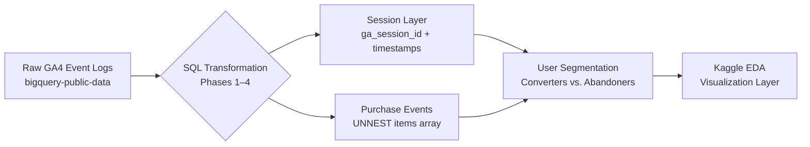

# GA4 Ecommerce Behavioral Analysis
## BigQuery SQL · Nested Data · Session Engineering · Conversion Funnel

> Most ecommerce dashboards tell you *what* is converted. This analysis asks *who almost did*, and why the traffic source that brought them in ultimately wasn't enough.

---

## Business Objective

GA4's raw event logs are a timestamped record of every click, scroll, and session fired by every user. The data stored as nested arrays in BigQuery, with no concept of a "session" or "user journey" pre-built. This project transforms that raw structure into a behavioral segmentation: **which acquisition channels produce users who purchase within 3 sessions, and what separates them from high-intent users who browse repeatedly and never convert?**

The goal is not to describe the data. It is to define what "high-intent abandonment" looks like in SQL, build the session layer from scratch, and surface a channel-level signal that a growth team could act on.

---

## Data Pipeline



**Dataset:** `bigquery-public-data.ga4_obfuscated_sample_ecommerce.events_*`  
**Window:** November 2020 – January 2021  
**Partitioning:** Queried via `_TABLE_SUFFIX` date filters to minimize slot usage

---

## Repository Structure

```
/ga4-ecommerce-behavioral-analysis
│
├── README.md
├── /sql
│   ├── 01_schema_exploration.sql   # Understand event structure, unnest patterns
│   ├── 02_session_layer.sql        # Build sessions from raw events (no session table exists)
│   ├── 03_user_segmentation.sql    # CASE WHEN labels, anti-join abandoner isolation
│   └── 04_conversion_analysis.sql  # Channel-level conversion by session depth
└── /visuals
    └── (exported charts from Kaggle EDA)
```

---

## SQL Engineering Highlights

### 1. Unnesting nested event parameters

GA4 stores every event attribute (e.g., session ID, page URL, engagement time) inside a repeated `STRUCT` array. There is no flat column. Two extraction patterns are used throughout this project:

**Subquery pattern:**  clean extraction of a single key:
```sql
/*
  Extracts ga_session_id and session sequence number from event_params & uses correlated subquery to avoid row explosion from CROSS JOIN
*/
SELECT
  user_pseudo_id,
  event_name,
  TIMESTAMP_MICROS(event_timestamp)                                  AS event_time,
  (SELECT value.int_value
   FROM UNNEST(event_params)
   WHERE key = 'ga_session_id')                                      AS session_id,
  (SELECT value.int_value
   FROM UNNEST(event_params)
   WHERE key = 'ga_session_number')                                  AS session_number
FROM `bigquery-public-data.ga4_obfuscated_sample_ecommerce.events_*`
WHERE _TABLE_SUFFIX BETWEEN '20201101' AND '20210131'
```

**CROSS JOIN UNNEST pattern:** used when filtering on a param value or joining to items:
```sql
/*
  Explodes the items array to get product-level purchase data.
  One row per item per purchase event.
*/
SELECT
  user_pseudo_id,
  item.item_name,
  item.item_category,
  item.price,
  item.quantity,
  (SELECT value.int_value
   FROM UNNEST(event_params)
   WHERE key = 'ga_session_id')                                      AS session_id
FROM `bigquery-public-data.ga4_obfuscated_sample_ecommerce.events_*`
CROSS JOIN UNNEST(items) AS item
WHERE _TABLE_SUFFIX BETWEEN '20201101' AND '20210131'
  AND event_name = 'purchase'
```

---

### 2. Building the Session Layer with CTEs + Window Functions

GA4 has no session table. Sessions are constructed by extracting `ga_session_id` per user and ranking chronologically.

```sql
/*
  Phase 2: Session layer construction.
  Produces one row per user-session with start time,
  session rank, and traffic source attribution.
*/
WITH raw_events AS (
  SELECT
    user_pseudo_id,
    TIMESTAMP_MICROS(event_timestamp)                                AS event_time,
    traffic_source.source                                            AS source,
    traffic_source.medium                                            AS medium,
    (SELECT value.int_value
     FROM UNNEST(event_params)
     WHERE key = 'ga_session_id')                                   AS session_id,
    (SELECT value.int_value
     FROM UNNEST(event_params)
     WHERE key = 'ga_session_number')                               AS session_number
  FROM `bigquery-public-data.ga4_obfuscated_sample_ecommerce.events_*`
  WHERE _TABLE_SUFFIX BETWEEN '20201101' AND '20210131'
),

session_layer AS (
  SELECT
    user_pseudo_id,
    session_id,
    session_number,
    source,
    medium,
    MIN(event_time)                                                   AS session_start,
    ROW_NUMBER() OVER (
      PARTITION BY user_pseudo_id
      ORDER BY MIN(event_time)
    )                                                                 AS session_rank
  FROM raw_events
  GROUP BY user_pseudo_id, session_id, session_number, source, medium
)

SELECT * FROM session_layer
```

---

### 3. Isolating Abandoners via Anti-Join

```sql
/*
  Identifies high-intent abandoners: users with 3+ sessions
  who never fired a purchase event.
  Anti-join pattern — LEFT JOIN + IS NULL.
*/
WITH multi_session_users AS (
  SELECT user_pseudo_id
  FROM session_layer
  GROUP BY user_pseudo_id
  HAVING COUNT(DISTINCT session_id) >= 3
),

purchasers AS (
  SELECT DISTINCT user_pseudo_id
  FROM `bigquery-public-data.ga4_obfuscated_sample_ecommerce.events_*`
  WHERE _TABLE_SUFFIX BETWEEN '20201101' AND '20210131'
    AND event_name = 'purchase'
)

SELECT
  m.user_pseudo_id,
  'high_intent_abandoner'                                            AS user_segment
FROM multi_session_users m
LEFT JOIN purchasers p
  ON m.user_pseudo_id = p.user_pseudo_id
WHERE p.user_pseudo_id IS NULL   -- returned 3+ times, never purchased
```

---

## Key Findings

> *Results populated after full analysis run. Findings updated here and visualized in Kaggle notebook.*

- **Finding 1 — Channel:** [Which source drives the highest share of session-1 converters]
- **Finding 2 — Abandoner profile:** [Device, source, and session depth pattern of high-intent non-converters]
- **Finding 3 — Session depth:** [What % of total conversions happen by session 3 vs. after]

📊 [View Interactive EDA on Kaggle →](https://www.kaggle.com/)

---

## How to Reproduce

1. **Access** — Open [BigQuery Console](https://console.cloud.google.com/bigquery). The `bigquery-public-data` project is available to all GCP accounts on the free tier.

2. **Run in order** — Execute scripts from `/sql` numerically. Each script builds on CTEs or logic defined in the prior one.

3. **Date filter** — All scripts use `_TABLE_SUFFIX BETWEEN '20201101' AND '20210131'`. Adjust to change the analysis window. Widening the range increases data scanned and may incur cost past the 1TB free tier monthly limit.

4. **No setup required** — No external dependencies, no staging tables needed. All transformation logic lives inside CTEs within each script.

---

## Technical Reflection

The core engineering choice in this project was keeping all transformation logic inside CTEs rather than materializing intermediate tables. This makes each script self-contained and reproducible in a single query run — closer to how an analyst would work in a shared BigQuery environment where you don't always have write permissions.

The unnesting pattern is the transferable skill here. Any company running GA4 on BigQuery has this exact schema. The ability to construct a session layer from raw event logs — rather than waiting for a pre-built sessions table — is the difference between being blocked and being unblocked.

---

*Dataset: Google Analytics 4 Obfuscated Sample — [bigquery-public-data.ga4_obfuscated_sample_ecommerce](https://developers.google.com/analytics/bigquery/web-ecommerce-demo-dataset)*
